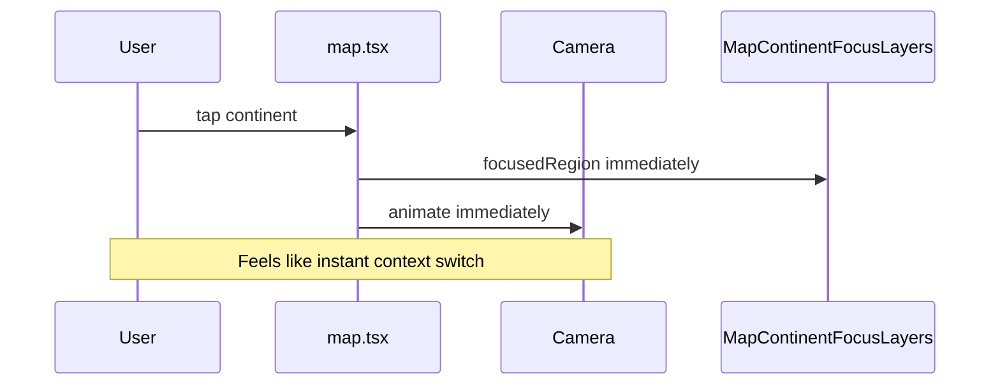
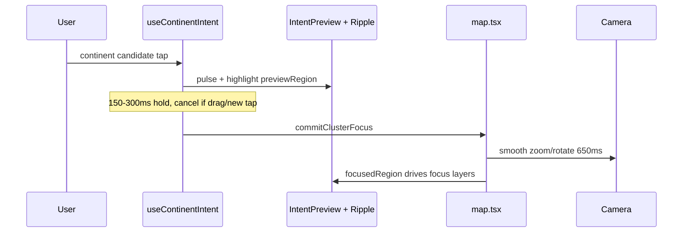

# Continent tap intent confirmation

## Current behavior (gap)

Today [`handleClusterPress`](<app/(tabs)/map.tsx>) commits immediately: sets `focusedRegion`, locks region, and starts a 650ms camera flight. [`handleMapPress`](<app/(tabs)/map.tsx>) and globe label [`Pressable`](components/map/globe-label-overlay.tsx) call it with no preview, delay, or drag guard.

When `focusedRegion` is set, map taps **no-op** (early return) with no feedback. Rivers are not modeled; ocean/water taps hit `onMapPress` but fail polygon hit-test and do nothing.



## Target behavior



| Surface                         | World zoom (`!focusedRegion`)      | Continent focus (`focusedRegion` set)                                                  |
| ------------------------------- | ---------------------------------- | -------------------------------------------------------------------------------------- |
| Different continent land/label  | Preview → delay → **commit focus** | **Ripple only** (no continent switch via map)                                          |
| Same continent (re-tap)         | Normal commit flow                 | **Pulse + recenter** via existing [`recenterOnFocusedContinent`](<app/(tabs)/map.tsx>) |
| Ocean / water / non-polygon tap | **Ripple**                         | **Ripple**                                                                             |
| Border/outline lines            | No action                          | No action                                                                              |
| Rivers                          | N/A (no layer)                     | N/A                                                                                    |

Chrome controls (prev/next continent, “Back to World”, region center) **bypass** intent and keep current immediate behavior.

**Re-tap choice:** pulse + gentle recenter (no duplicate `setFocusedRegion`, no exit). Matches existing `handleBackToContinent` camera path without toggling exploration mode.

---

## Architecture

### 1. Central intent hook

Add [`hooks/use-continent-intent.ts`](hooks/use-continent-intent.ts) + timing constants in [`constants/map-continent-focus.ts`](constants/map-continent-focus.ts) (or small [`lib/map-continent-intent.ts`](lib/map-continent-intent.ts)):

| Constant                             | Suggested value              |
| ------------------------------------ | ---------------------------- |
| `MAP_CONTINENT_INTENT_DELAY_MS`      | `200` (within 150–300ms)     |
| `MAP_TAP_DRAG_THRESHOLD_PX`          | `10`                         |
| `MAP_CONTINENT_PREVIEW_FILL_OPACITY` | ~0.12 (below committed 0.18) |

Hook API (local to map screen, not Zustand):

- `requestContinentFocus(cluster, source)` — Step 1: set `previewRegion`, fire light haptic, start timer; Step 3 on timer: call `onCommit(cluster)`
- `cancelIntent()` — new tap, mode change, back-to-world, or drag detected
- `previewRegion: string | null` for visuals
- `rippleAt: { lat, lng } | null` for non-commit taps

Split [`handleClusterPress`](<app/(tabs)/map.tsx>) into:

- `commitClusterFocus` — current body (state + camera)
- `requestContinentFocus` — wired from map/labels after guards

### 2. Soft target confirmation (Step 1–3 visuals)

**2D — extend [`MapContinentFocusLayers`](components/map/map-continent-focus-layers.tsx)**

- New prop `previewRegion?: string | null` (separate from `focusedRegion`)
- While previewing: render accent fill on that continent only + optional world scrim at lower opacity (reuse [`mapFocusAccentRgba`](constants/map-continent-focus.ts))
- Committed focus unchanged (`focusedRegion` drives full scrim/fill as today)

**Tap pulse ring — new [`components/map/map-tap-ripple.tsx`](components/map/map-tap-ripple.tsx)**

- Reanimated scale + fade circle (pattern from [`map-country-marker.tsx`](components/map/map-country-marker.tsx) `pulseRing`, but single burst, not loop)
- **2D:** parent calls `mapRef.pointForCoordinate` (or `MapView` ref) to position ripple at lat/lng
- **3D:** use [`projectLatLngToScreen`](lib/globe-screen-project.ts) with globe camera + layout size (same approach as label overlay)

Mount ripple overlay in [`map-canvas.tsx`](components/map/map-canvas.tsx) above map/globe, `pointerEvents="none"`.

### 3. Snap threshold / drag guard (globe)

[`lib/globe-orbit-controls.ts`](lib/globe-orbit-controls.ts) already tracks `rotateStart` / `rotateDelta` but never exposes movement.

- On `onTouchStart`, record `touchStart` (pageX/Y)
- On `onTouchMove`, if distance from start > `MAP_TAP_DRAG_THRESHOLD_PX`, set `interactionExceededTapThreshold = true`
- Expose `consumeTapThresholdExceeded(): boolean` (read + reset on release)

In [`globe-view.tsx`](components/map/globe-view.tsx) `handleGlobeSurfacePress`: if threshold exceeded, **do not** call `onGlobeSurfacePress`.

Route label [`onContinentPress`](components/map/globe-label-overlay.tsx) through the same guard (orbit may have rotated just before label press).

**2D:** `react-native-maps` `onPress` usually does not fire after pan; no new library. Optional follow-up: log on device; only add pan tracking if mis-taps persist.

### 4. Tap affordance biasing

| Change                                   | File                                                                                                                                                                                           |
| ---------------------------------------- | ---------------------------------------------------------------------------------------------------------------------------------------------------------------------------------------------- |
| Larger continent label hit slop          | [`globe-label-overlay.tsx`](components/map/globe-label-overlay.tsx) — increase `continentHitArea` padding / `minWidth` (~96→112)                                                               |
| Stronger dim outside focus               | [`constants/map-continent-focus.ts`](constants/map-continent-focus.ts) — bump `MAP_SCRIM_MAX_OPACITY` slightly when `focusedRegion` set (e.g. 0.09 → 0.12)                                     |
| Nearest-continent bias (optional, small) | [`lib/map-map-tap-hit.ts`](lib/map-map-tap-hit.ts) — if tap misses all polygons but is within ~1° of a country bbox edge, prefer that country’s cluster (reduces “missed” land taps at coasts) |

No new dependencies (`react-native-gesture-handler` stays unused on map per project rules).

### 5. Rewire [`handleMapPress`](<app/(tabs)/map.tsx>)

```ts
// Pseudocode flow
if (selectedCountry) { dismissPreview(); return; }

if (coordinate) {
  const cluster = findClusterAtWorldCoordinate(...);

  if (focusedRegion) {
    if (cluster?.region === focusedRegion) {
      triggerPreviewPulse(); // visual only
      recenterOnFocusedContinent(cluster);
    } else {
      showRipple(coordinate);
    }
    return;
  }

  if (is3d || zoomTier === "world") {
    if (cluster) requestContinentFocus(cluster);
    else showRipple(coordinate);
    return;
  }
}

// spotlight dismiss, etc. unchanged
```

Globe label + region chrome: labels call `requestContinentFocus`; chrome calls `commitClusterFocus` directly.

### 6. Cancel / edge cases

Cancel pending intent when:

- User taps again (different target → new preview; same → restart timer optional)
- `handleBackToWorld`, map mode toggle, country preview open
- Drag threshold exceeded (globe)
- Component unmount (`useEffect` cleanup)

If user taps continent B while A is previewing: cancel A, preview B, single timer.

---

## Files to touch (focused diff)

| File                                                                                             | Change                                                             |
| ------------------------------------------------------------------------------------------------ | ------------------------------------------------------------------ |
| [`hooks/use-continent-intent.ts`](hooks/use-continent-intent.ts)                                 | **New** — timer + preview state                                    |
| [`constants/map-continent-focus.ts`](constants/map-continent-focus.ts)                           | Intent/preview timing & opacity tokens                             |
| [`app/(tabs)/map.tsx`](<app/(tabs)/map.tsx>)                                                     | Split commit vs request; focused-region ripple/recenter; wire hook |
| [`components/map/map-canvas.tsx`](components/map/map-canvas.tsx)                                 | Pass `previewRegion`, ripple props                                 |
| [`components/map/world-map-view.tsx`](components/map/world-map-view.tsx)                         | Preview layers + ripple host ref                                   |
| [`components/map/map-continent-focus-layers.tsx`](components/map/map-continent-focus-layers.tsx) | `previewRegion` rendering                                          |
| [`components/map/map-tap-ripple.tsx`](components/map/map-tap-ripple.tsx)                         | **New** — burst ripple                                             |
| [`components/map/globe-view.tsx`](components/map/globe-view.tsx)                                 | Drag guard on surface press                                        |
| [`lib/globe-orbit-controls.ts`](lib/globe-orbit-controls.ts)                                     | Movement threshold API                                             |
| [`components/map/globe-label-overlay.tsx`](components/map/globe-label-overlay.tsx)               | Hit area + intent callback                                         |
| [`lib/map-map-tap-hit.ts`](lib/map-map-tap-hit.ts)                                               | Optional coast bias (small)                                        |

**Out of scope:** river polygons (no data); border-line tap targets; modals/alerts; installing gesture-handler.

---

## Testing checklist

1. **World 2D:** tap Africa → brief highlight/pulse → ~200ms later smooth zoom; mis-drag on map should not change continent (verify on device).
2. **World 3D:** rotate globe, release, tap continent — should not commit if finger moved > threshold during gesture.
3. **World 3D:** tap ocean → ripple only, no focus.
4. **Focused:** tap same continent land → recenter pulse, no region change.
5. **Focused:** tap another continent’s land → ripple only, stay in current continent.
6. **Chrome:** prev/next continent still switches immediately.
7. **Rapid double-tap:** second tap cancels/replaces preview; only one final commit.
8. Run `npm run lint` and `npm run typecheck`.
