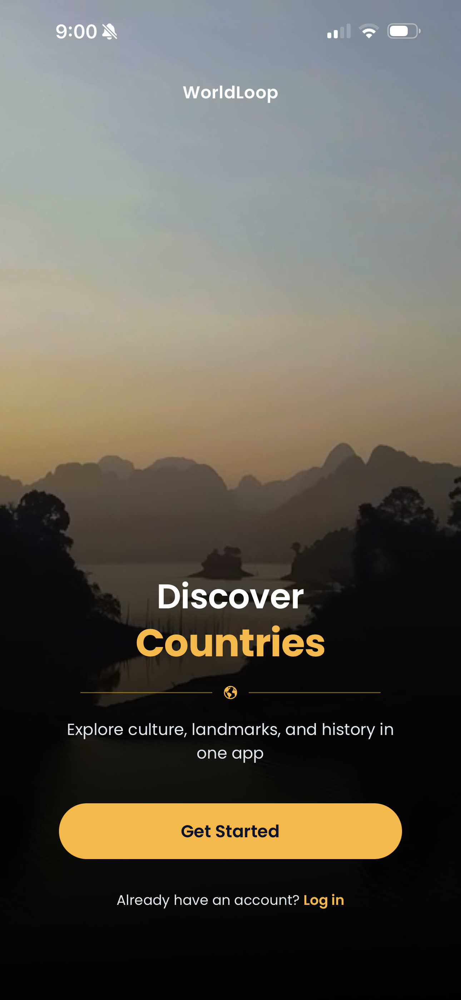
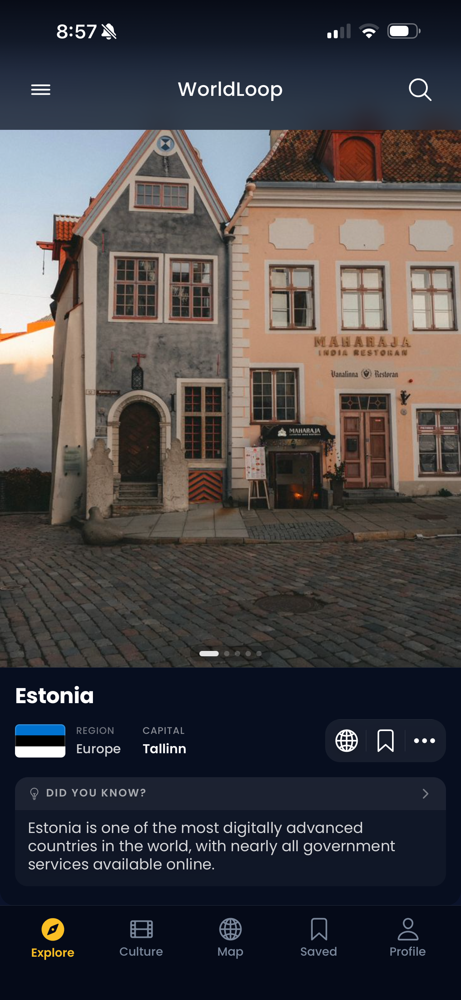
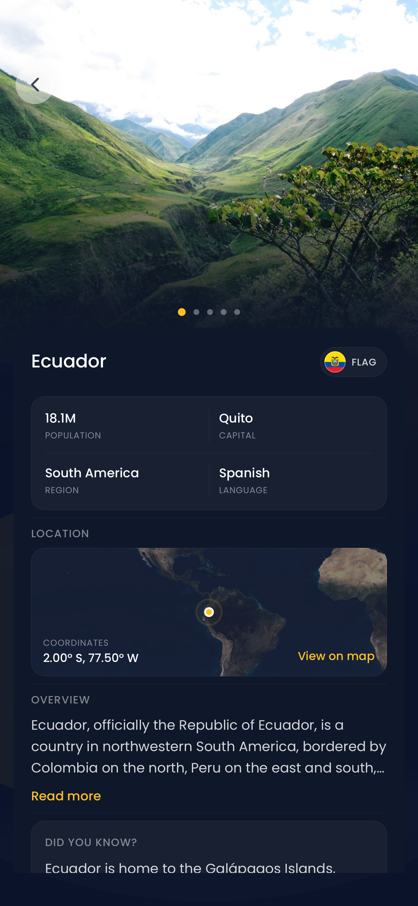
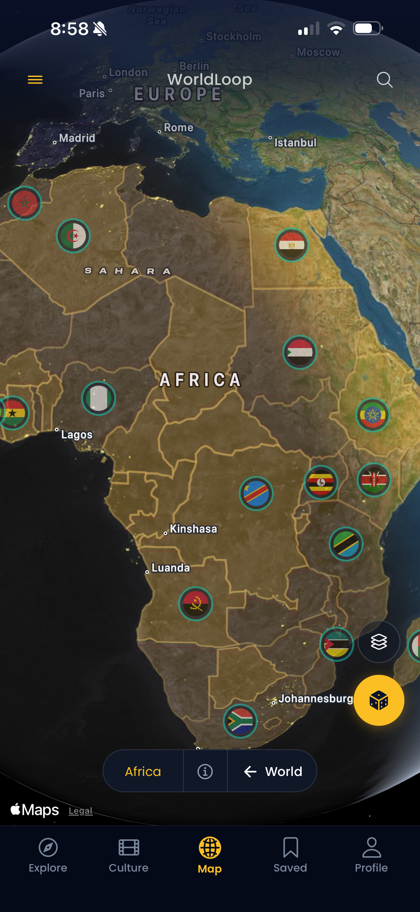
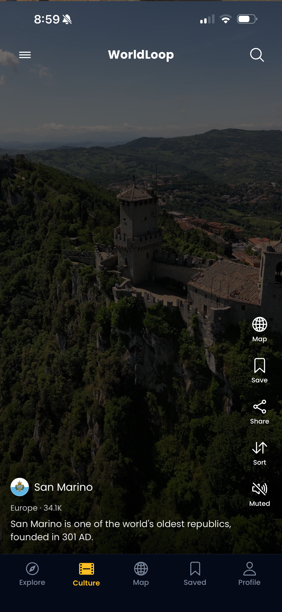
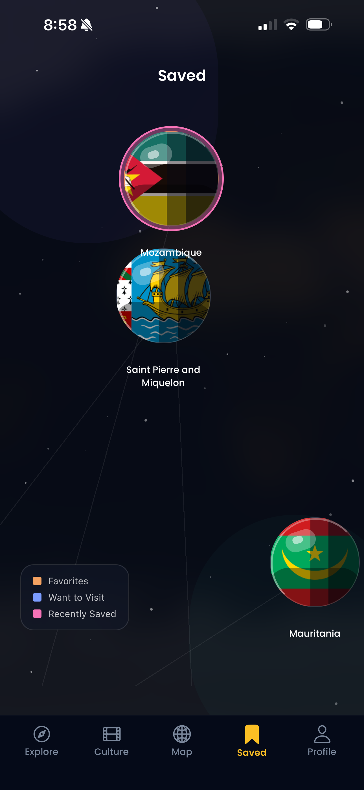
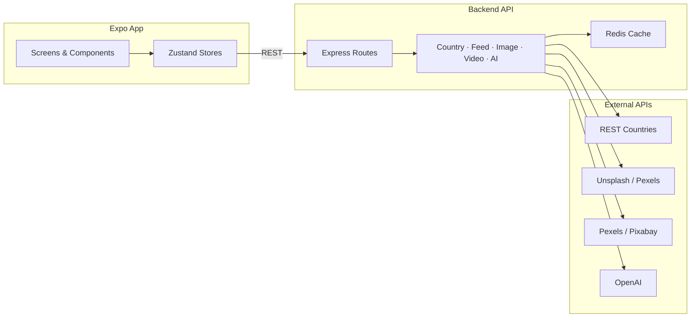

<div align="center">

# WorldLoop

**Discover the world, one country at a time.**

A TikTok-style mobile app for exploring countries through immersive feeds, interactive maps, AI-generated insights, and culture videos.

[](https://expo.dev)
[](https://reactnative.dev)
[](https://www.typescriptlang.org)
[](https://nodejs.org)
[](https://redis.io)

</div>

---

## Overview

WorldLoop turns every country into a swipeable content unit — like a short-form video feed, but for geography and culture. Users browse portrait hero imagery, watch travel clips, spin a 3D globe, and dive into AI-powered country profiles.

The project is built as a **full-stack learning showcase**: a polished Expo mobile client paired with a TypeScript API that handles caching, media sourcing, and AI generation server-side.

---

## Features

| Screen          | What it does                                                                     |
| --------------- | -------------------------------------------------------------------------------- |
| **Onboarding**  | Welcome flow with hero imagery and a clear path into the app                     |
| **Explore**     | Vertical, full-screen country feed with hero images, stats, and AI fun facts     |
| **AI Explorer** | Deep-dive country profile with stats, map focus, and Wikipedia context           |
| **Map**         | Interactive globe with country pins, spatial discovery, and tap-to-preview       |
| **Culture**     | TikTok-style vertical video feed sourced from travel & culture clips per country |
| **Saved**       | Bookmark countries on a constellation-style saved space                          |
| **Search**      | Global search overlay with region filters across feeds and map                   |

### Highlights

- **TikTok-style UX** — vertical paging feeds with snap transitions and immersive media
- **Smart image pipeline** — Unsplash → Pexels → Wikipedia fallback, cached per country in Redis
- **Video culture feed** — portrait-first travel clips from Pexels / Pixabay
- **Spatial discovery** — viewport-based country ranking on the map via bounding-box queries
- **AI content layer** — fun facts, captions, and explorer summaries generated server-side
- **Responsive imagery** — backend serves size-appropriate image variants based on device pixel width

---

## Screenshots

Device captures from the Expo app (`assets/screenshots/`), in screen order:

<table>
  <tr>
    <td align="center"><b>Onboarding</b><br/></td>
    <td align="center"><b>Explore</b><br/></td>
    <td align="center"><b>AI Explorer</b><br/></td>
  </tr>
  <tr>
    <td align="center"><b>Map</b><br/></td>
    <td align="center"><b>Culture</b><br/></td>
    <td align="center"><b>Saved</b><br/></td>
  </tr>
</table>

---

## Architecture



**Design principles**

- API keys and AI calls stay on the backend — never in the mobile client
- Country data is normalized into a single content model consumed by every screen
- Redis caches expensive upstream calls (images, videos, AI) with long TTLs
- Zustand + AsyncStorage handle client state and persistence

---

## Tech Stack

### Mobile (Expo)

| Layer     | Tools                                                 |
| --------- | ----------------------------------------------------- |
| Framework | Expo SDK 54, React Native, Expo Router                |
| Language  | TypeScript                                            |
| Styling   | NativeWind v5, Tailwind CSS v4                        |
| State     | Zustand, AsyncStorage                                 |
| Media     | expo-image, expo-video, Lottie                        |
| Maps & 3D | react-native-maps, Three.js, @react-three/fiber       |
| Animation | react-native-reanimated, react-native-gesture-handler |

### Backend

| Layer   | Tools                          |
| ------- | ------------------------------ |
| Runtime | Node.js, Express 5, TypeScript |
| Cache   | Redis 7 (Docker)               |
| Data    | REST Countries API             |
| Images  | Unsplash, Pexels, Wikipedia    |
| Video   | Pexels Video, Pixabay          |
| AI      | OpenAI (gpt-4o-mini)           |

---

## Getting Started

### Prerequisites

- Node.js 20+
- [Docker Desktop](https://www.docker.com/products/docker-desktop/) (recommended, for Redis)
- iOS Simulator, Android Emulator, or Expo Go

### 1. Clone & install

```bash
git clone https://github.com/<birthtand>/worldloop.git
cd worldloop
npm install
```

### 2. Start Redis

```bash
docker compose up -d redis
docker compose exec redis redis-cli ping   # should return PONG
```

### 3. Configure environment

```bash
# Mobile app
cp .env.example .env

# Backend API
cd backend
cp .env.example .env
npm install
```

Add API keys in `backend/.env` as needed (images, video, and AI features degrade gracefully without them):

```env
UNSPLASH_ACCESS_KEY=
PEXELS_API_KEY=
PIXABAY_API_KEY=
OPENAI_API_KEY=
```

### 4. Run the backend

```bash
cd backend
npm run dev
# → http://localhost:3001
```

Confirm the startup log shows `Redis connected`.

### 5. Run the app

```bash
# from repo root
npx expo start
```

Press `i` for iOS Simulator, `a` for Android Emulator, or scan the QR code with Expo Go.

---

## Project Structure

```txt
worldloop/
├── app/                  # Expo Router screens (tabs, onboarding, country routes)
├── assets/
│   └── screenshots/      # README & portfolio device captures (s1–s6)
├── components/           # Reusable UI (explore, culture, map, ai-explorer, …)
├── store/                # Zustand stores (feeds, map, search, saved)
├── lib/                  # API client, map math, formatting helpers
├── hooks/                # Data-fetching and screen logic hooks
├── constants/            # Themes, images, regions, map styles
├── backend/              # Node.js + Express API
│   └── src/
│       ├── api/          # Route definitions
│       ├── controllers/  # Request handlers
│       ├── services/     # Business logic (feed, image, video, AI, cache)
│       └── lib/          # Validation, upstream helpers
├── prompts-worldloop/    # Incremental backend build prompts
└── docker-compose.yml    # Local Redis
```

---

## API Overview

| Method | Endpoint                  | Description                    |
| ------ | ------------------------- | ------------------------------ |
| `GET`  | `/health`                 | Health check                   |
| `GET`  | `/country/:name`          | Single country with images     |
| `GET`  | `/feed/countries`         | Paginated explore feed         |
| `GET`  | `/feed/culture/countries` | Video-only culture feed        |
| `GET`  | `/map/countries`          | All countries with coordinates |
| `GET`  | `/discover`               | Spatial bbox country discovery |

Full backend docs: [`backend/README.md`](backend/README.md)

---

## Scripts

### Mobile

```bash
npm start          # Expo dev server
npm run android    # Open on Android
npm run ios        # Open on iOS
npm run lint       # ESLint
npm run typecheck  # TypeScript check
npm test           # Vitest
```

### Backend

```bash
cd backend
npm run dev        # Watch mode (tsx)
npm run build      # Compile to dist/
npm run typecheck  # TypeScript check
```

---

## What I Built

This project demonstrates end-to-end mobile product development:

- **Feed engineering** — cursor-based pagination, prefetching, and region filters
- **Map & spatial UX** — 3D globe rendering, clustering, viewport discovery
- **Media orchestration** — multi-provider fallbacks with Redis-backed caching
- **API design** — typed services, validation, rate limiting, and secure key handling
- **Mobile polish** — custom tab bar, glass UI, onboarding, and immersive full-screen layouts

---

## License

This project is for portfolio and educational purposes. External API content (images, videos) is subject to each provider's terms of use.

---

<div align="center">

Built with Expo · React Native · TypeScript

</div>
