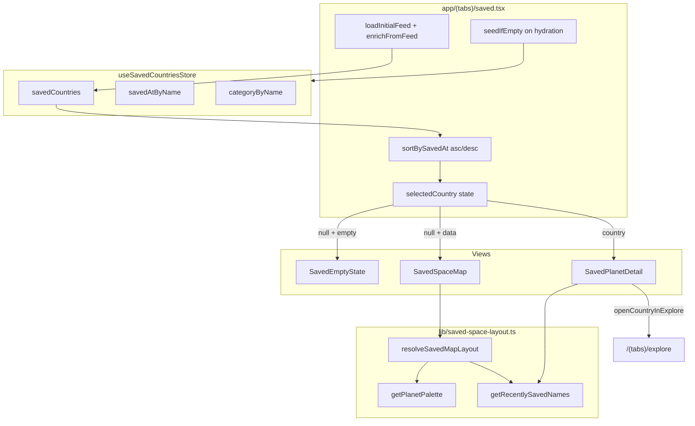

Read AGENTS.md first and follow it strictly.

Reference: `assets/savedUI/` (frame captures of the implemented Saved Space UI), `AGENTS.md` (app structure, data model), `prompts/08-zustand.md`, `prompts/09-bottom-tab-nav.md`, `prompts/10a-explore-ui.md`

This document describes **how the Saved tab is wired today** — a cosmic **Saved Space** map where each bookmarked country appears as an interactive planet. Use it when extending the screen, debugging layout, or teaching the feature.

> **Note:** The original `prompt_material/saved-screen-ui.png` spec (category filter tabs, Favorites hero card, Want to Visit carousel, Recently Saved list) was replaced by the Saved Space design. The store fields (`categoryByName`, `savedAtByName`) remain and drive planet color accents.

## Goal

The Saved tab (`app/(tabs)/saved.tsx`) is a **three-state bookmark library**:

1. **Empty** — header + friendly empty state with Explore CTA
2. **Map** — pannable cosmic field of planet nodes connected in save-order chain
3. **Detail** — horizontal pager of selected country with sphere hero + “Explore in feed” CTA

Saving and unsaving countries happens from **Explore**, **Home**, and **Map** via `toggleSaved` — the Saved screen is read/browse/navigation, not a bookmark editor.

## Prerequisites

- `prompts/09-bottom-tab-nav.md` — `(tabs)` routes and custom `components/bottom-tab-bar.tsx`
- `prompts/08-zustand.md` — `store/use-saved-countries-store.ts`, `store/use-country-feed-store.ts`, `types/country.ts`
- `prompts/10a-explore-ui.md` — `lib/open-country-in-explore.ts` for opening a country in the Explore feed
- `prompts/01-nativewind.md` and `prompts/02-design-theme.md` — theme tokens in `global.css`
- Backend feed (`GET /feed/countries`) — used to enrich saved entries with full `Country` objects

## Dependencies

Already installed and used by Saved Space:

- `expo-router`, `expo-image`, `expo-blur`, `expo-status-bar`
- `zustand`, `@react-native-async-storage/async-storage`
- `react-native-reanimated`
- `react-native-safe-area-context`

No React Query, axios, or `react-native-svg` in this screen.

## Route & files

| Path                                           | Purpose                                                               |
| ---------------------------------------------- | --------------------------------------------------------------------- |
| `app/(tabs)/saved.tsx`                         | Screen orchestrator — hydration, feed enrichment, view state, sorting |
| `components/saved/saved-space-background.tsx`  | Full-screen earth map + blur + nebula + procedural stars              |
| `components/saved/saved-space-header.tsx`      | Centered **Saved** title; optional back button in detail view         |
| `components/saved/saved-back-button.tsx`       | Outlined **back** pill — returns from detail to map                   |
| `components/saved/saved-space-map.tsx`         | Nested horizontal/vertical `ScrollView` viewport + planet layout      |
| `components/saved/saved-planet-node.tsx`       | Tappable planet on the map (sphere + country name, drift animation)   |
| `components/saved/saved-planet-sphere.tsx`     | Layered sphere illusion with centered flag                            |
| `components/saved/saved-space-connections.tsx` | Thin lines linking planets in save-order chain                        |
| `components/saved/saved-space-legend.tsx`      | Color key: Favorites / Want to Visit / Recently Saved                 |
| `components/saved/saved-planet-detail.tsx`     | Detail pager — sphere hero, description, Explore CTA                  |
| `components/saved/saved-empty-state.tsx`       | Empty message + optional **Explore countries** button                 |
| `lib/saved-space-layout.ts`                    | Layout engine — scatter, collision, palettes, scroll origin           |
| `lib/saved-country-copy.ts`                    | AI fact / seed fallback descriptions for detail view                  |
| `store/use-saved-countries-store.ts`           | Persisted bookmarks, timestamps, categories, seed data                |
| `constants/images.ts`                          | `images.earthMap` background asset                                    |

Unused helper (from prior design, kept for future use):

| Path                            | Purpose                                                 |
| ------------------------------- | ------------------------------------------------------- |
| `lib/saved-explored-percent.ts` | Exploration % stubs — **not wired** into Saved Space UI |

## Screen state machine

`saved.tsx` owns local `selectedCountry: Country | null` and derives three mutually exclusive views:

```
hydrated + savedCountries.length === 0  →  EMPTY
hydrated + savedCountries.length > 0
  + selectedCountry == null             →  MAP
  + selectedCountry != null             →  DETAIL
```

Transitions:

| From   | Action                               | To                                                             |
| ------ | ------------------------------------ | -------------------------------------------------------------- |
| Map    | Tap planet node                      | Detail (sets `selectedCountry`)                                |
| Detail | Tap **back**                         | Map (`setSelectedCountry(null)`)                               |
| Detail | Swipe horizontal pager               | Detail (updates `selectedCountry` via `onSelectedIndexChange`) |
| Any    | User unsaves all countries elsewhere | Empty                                                          |

`FadeIn` / `FadeOut` reanimated transitions wrap each view shell.

## Data wiring

### Saved store (`useSavedCountriesStore`)

Persisted key: `worldloop-saved-countries` (AsyncStorage).

| Field            | Type                            | Purpose                                                               |
| ---------------- | ------------------------------- | --------------------------------------------------------------------- |
| `savedCountries` | `Country[]`                     | Bookmarked countries (unique by `name`)                               |
| `savedAtByName`  | `Record<string, number>`        | Epoch ms when each country was saved                                  |
| `categoryByName` | `Record<string, SavedCategory>` | `'favorites' \| 'want-to-visit'` per country                          |
| `hasSeeded`      | `boolean`                       | Sentinel — prevents demo seed from re-running after intentional clear |

**Actions used by Saved screen:**

| Action                          | When called           | Behavior                                                      |
| ------------------------------- | --------------------- | ------------------------------------------------------------- |
| `seedIfEmpty()`                 | After store hydration | Seeds 7 demo countries if list empty and never seeded         |
| `enrichFromFeed(feedCountries)` | When feed loads       | Merges full feed `Country` objects into saved entries by name |

**Actions used elsewhere (Explore / Home / Map):**

| Action                 | Behavior                                                                                          |
| ---------------------- | ------------------------------------------------------------------------------------------------- |
| `toggleSaved(country)` | Save: append country, set `savedAt`, default category `'favorites'`. Unsave: remove from all maps |
| `isSaved(name)`        | Bookmark icon state in other tabs                                                                 |

**Not used on Saved screen today:** `setCategory`, `getCountriesByCategory`, `clearSaved` (dev tools only).

### Feed store (`useCountryFeedStore`)

On mount, `saved.tsx`:

1. Calls `loadInitialFeed()` when `feedStatus === "idle"` and feed is empty
2. Passes `feedCountries` into `enrichFromFeed()` so saved planets get images, AI facts, etc.

### Sorting (two orders)

| Use          | Sort                                       | Reason                              |
| ------------ | ------------------------------------------ | ----------------------------------- |
| Map planets  | `savedAt` **ascending** (oldest → newest)  | Chain connections follow save order |
| Detail pager | `savedAt` **descending** (newest → oldest) | Swipe starts on most recently saved |

Implemented via local `sortBySavedAt()` in `saved.tsx`.

### Seed data (first launch)

When `savedCountries` is empty after hydration and `hasSeeded` is false, `seedIfEmpty()` inserts:

| Country     | Category        | Relative `savedAt` |
| ----------- | --------------- | ------------------ |
| Peru        | `favorites`     | 3 days ago         |
| Japan       | `want-to-visit` | 1 week ago         |
| Iceland     | `want-to-visit` | 5 days ago         |
| New Zealand | `want-to-visit` | 2 days ago         |
| Italy       | `favorites`     | 2 hours ago        |
| Morocco     | `favorites`     | yesterday          |
| Canada      | `want-to-visit` | 2 days ago         |

Each seed includes minimal `Country` fields + inline `ai.fact` copy. Feed enrichment upgrades them when the backend responds.

### Category → planet palette

Defined in `lib/saved-space-layout.ts` (`getPlanetPalette`):

| Signal                                  | Map appearance                    | Detail appearance                     |
| --------------------------------------- | --------------------------------- | ------------------------------------- |
| `favorites`                             | Orange core/band when accented    | Full category palette on large sphere |
| `want-to-visit`                         | Teal core/band when accented      | Full category palette on large sphere |
| **Recently saved** (top 1 by `savedAt`) | Pink glow + ring accent on map    | Pink glow + ring on detail sphere     |
| No accent (map default)                 | Dark neutral sphere, no glow/ring | Category colors on detail only        |

**Recently saved** = the single most recent entry (`RECENTLY_SAVED_LIMIT = 1`). On the map, that planet is swapped to the topmost anchor position and the viewport scrolls to center it on first layout.

Legend swatch colors (`SAVED_LEGEND_COLORS`):

- Favorites — `#f4a261`
- Want to Visit — `#7b9cff`
- Recently Saved — `#f472b6`

### Country copy (detail view)

`getSavedCountryDescription(country, maxLength)` in `lib/saved-country-copy.ts`:

1. `getAiFact(country)` from feed-enriched data
2. Seed-specific fallback copy when AI fact is still loading
3. Generic fallback: `"Discover culture, landscapes, and stories worth saving."`
4. Truncated with ellipsis when over `maxLength` (420 in detail)

## Layout engine (`lib/saved-space-layout.ts`)

`resolveSavedMapLayout(countries, categoryByName, savedAtByName, viewportWidth, viewportHeight)` returns `null` until the map viewport has non-zero dimensions.

Pipeline:

1. **`generateCreativeSlots`** — golden-angle spiral scatter with seeded RNG (deterministic per country set)
2. **`resolveSpreadScaleWithOverflow`** — scale slots until nodes don't overlap (`MIN_NODE_GAP = 16`)
3. **Normalize anchors** — center cluster, add edge padding, expand canvas when pan is needed
4. **Build `SavedPlanetNode[]`** — attach palette, anchor, center per country
5. **`placeRecentlySavedAtTop`** — swap recent planet to topmost screen position
6. **`buildSavedChainConnections`** — link index `i` → `i + 1` in save-order array
7. **`computeInitialScrollToRecent`** — scroll map to center the recently saved planet

Map panning: nested `ScrollView` (horizontal outer, vertical inner). Scrolling enabled only when canvas exceeds viewport.

## UI breakdown

### Screen shell

- **Background:** `SavedSpaceBackground` — `images.earthMap`, dark blur (`expo-blur`), scrim, nebula washes, 36 procedural stars
- **Safe area:** `SafeAreaView` with `backgroundColor: #0b132b` (StyleSheet — not NativeWind)
- **Tab bar clearance:** floating legend sits `TAB_BAR_CONTENT_HEIGHT + insets.bottom + 12` above bottom
- Map view uses `paddingBottom: 0`; empty view uses `paddingBottom: 112`

### Header (`SavedSpaceHeader`)

- Centered **Saved** title (`18px`, semibold, white)
- Map / empty: title only
- Detail: **back** button left-aligned (`SavedBackButton`), title centered

### Map view

- `SavedSpaceMap` fills remaining space
- Each `SavedPlanetNode`: `SavedPlanetSphere` + country name (2 lines max)
- Entrance stagger + gentle vertical drift (`react-native-reanimated`)
- `SavedSpaceConnections` draws 1px semi-transparent lines between chained centers
- Floating legend (`SavedSpaceLegend variant="floating"`) — blurred pill, bottom-left

### Detail view

- Header with back button
- Inline legend (`SavedSpaceLegend`)
- Swipe hint when multiple countries: `Swipe to browse · {n} / {total}`
- `FlatList` horizontal pager (or single page when count === 1)
- Per page: large sphere (248px), `FlagBadge` + name, description, gold **Explore in feed** button

### Empty state

- Header + `SavedEmptyState`
- Copy: `"No saved countries yet — explore the world and tap Save on places you love."`
- CTA → `router.push("/(tabs)/explore")`

## Navigation

| Action                            | Behavior                                                                                         |
| --------------------------------- | ------------------------------------------------------------------------------------------------ |
| Tap planet on map                 | Open detail for that country                                                                     |
| Tap **back** in detail            | Return to map                                                                                    |
| Swipe detail pager                | Browse saved countries (newest-first order)                                                      |
| Tap **Explore in feed**           | `openCountryInExplore(country)` — closes search, focuses country, navigates to `/(tabs)/explore` |
| Tap **Explore countries** (empty) | `router.push("/(tabs)/explore")`                                                                 |
| Save / unsave                     | **Not on Saved screen** — use Explore action rail, Home card, or Map preview                     |

## Styling rules

- **NativeWind** `className` for typography on `Text`, `Pressable` where supported
- **StyleSheet** for: `SafeAreaView`, absolute planet positioning, blur shells, shadows, animated transforms, nested `ScrollView` content sizes, gradient/scrim layers
- Do **not** put `className` on `SafeAreaView`

## Out of scope (current implementation)

- In-screen bookmark toggle / unsave
- Category filter tabs or sectioned lists (Favorites / Want to Visit / Recently Saved as separate scroll regions)
- Search and filter header buttons
- Exploration % rings or progress bars on cards
- `setCategory` UI (long-press to move between Favorites and Want to Visit)
- Cloud sync / Clerk auth for bookmarks
- Dedicated “View All” list routes
- `getCountryExploredPercent` integration

## Acceptance criteria (current)

- Saved tab renders Saved Space map (not a placeholder) when countries are saved
- Empty state shows when `savedCountries.length === 0`
- Planets reflect category + recently-saved accent colors per legend
- Map is pannable when layout exceeds viewport; initial scroll centers recently saved planet
- Chain lines connect planets in save-order (oldest → newest)
- Tapping a planet opens detail; back returns to map
- Detail pager swipes through countries; **Explore in feed** opens Explore on the selected country
- First launch seeds demo countries; feed enrichment upgrades them silently
- Saved list, timestamps, and categories persist across app restarts
- `npm run lint` and `npm run typecheck` pass

## Testing

```bash
# Terminal 1 — backend + Redis
# Terminal 2
npx expo start
```

1. Open **Saved** tab — cosmic map with seeded planets on first launch
2. Confirm floating legend shows three color labels
3. Pan map if many countries — scroll works, planets stay positioned
4. Recently saved planet (Italy in seed) should be accented and near initial viewport center
5. Tap a planet — detail opens with sphere, name, description, **Explore in feed**
6. Tap **back** — returns to map
7. Swipe detail pager — index hint updates (`1 / 7`, etc.)
8. Tap **Explore in feed** — Explore tab opens on that country
9. Save a new country from Explore — return to Saved — new planet appears; chain grows
10. Unsave all from Explore — Saved shows empty state with CTA
11. Restart app — saved list persists; `hasSeeded` prevents re-seeding after user cleared everything

## Architecture diagram



## Next steps

1. In-screen unsave (bookmark on detail) with list animation
2. `setCategory` UI — long-press or detail action to move Favorites ↔ Want to Visit
3. Search / filter within saved collection
4. Reintroduce exploration % on detail or map nodes via `lib/saved-explored-percent.ts` + `useDiscoveryProgressStore`
5. Dedicated list view per category (“View All”)
6. Cloud sync when Clerk auth is wired
