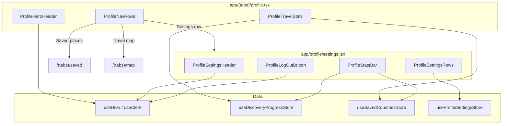

Read AGENTS.md first and follow it strictly.

Reference: `assets/images/profile-main-ui.png`, `assets/images/profile-settings.png`, `AGENTS.md` (app structure), `prompts/09-bottom-tab-nav.md`, `prompts/05-clerk.md`, `prompts/08-zustand.md`, `prompts/10d-saved-ui.md`

Implement the **Profile** tab and a **Settings** sub-screen exactly as shown in the attached designs. Match layout, typography, colors, radii, spacing, and icon treatments pixel-for-pixel — do not simplify either screen.

Use assets from `assets/` via the centralized `constants/images.ts` import (`import { images } from "@/constants/images"`). Register any new image assets there before using them in screens or components.

@assets/images/profile-main-ui.png

@assets/images/profile-settings.png

@assets/images/profile-avatar.png

## Goal

Replace the Profile tab placeholder (`app/(tabs)/profile.tsx`) with two connected screens:

1. **Profile hub** — hero header, user identity, travel stats, and navigation rows (Saved places, Visited countries, Travel map, Settings)
2. **Settings** — compact account header, stats bar, preferences list, and Log out

The Profile tab is the user's home for identity, discovery progress, and app preferences. Wire real data from Clerk and existing Zustand stores where possible; use sensible local defaults for stats the app does not track yet.

## Prerequisites

- `prompts/09-bottom-tab-nav.md` — `(tabs)` routes and `components/bottom-tab-bar.tsx` (Explore, Culture, Map, Saved, Profile)
- `prompts/05-clerk.md` — Clerk auth wired; signed-in users reach `(tabs)` via `useAuth()`
- `prompts/08-zustand.md` — feed, saved, and discovery progress stores
- `prompts/01-nativewind.md` and `prompts/02-design-theme.md` — theme tokens in `global.css`, Poppins fonts
- `prompts/10d-saved-ui.md` — Saved tab for **Saved places** navigation target

## Dependencies

Use what is already installed:

- `expo-router`, `expo-image`
- `@clerk/expo` (`useUser`, `useClerk` for sign out)
- `zustand`, `@react-native-async-storage/async-storage`
- `@expo/vector-icons` (Ionicons)
- `react-native-safe-area-context`

Do **not** add chart libraries, React Query, or new navigation libraries without user approval.

## Route & files

| Path                                             | Purpose                                                                               |
| ------------------------------------------------ | ------------------------------------------------------------------------------------- |
| `app/(tabs)/profile.tsx`                         | Profile hub screen — composes hero, stats, navigation rows                            |
| `app/profile/settings.tsx`                       | Settings sub-screen — preferences list + log out (stack route, tab bar still visible) |
| `components/profile/profile-hero-header.tsx`     | Scenic hero background, avatar, name, handle, bio, inline stats, Edit profile button  |
| `components/profile/profile-travel-stats.tsx`    | Four-card travel stats grid (Countries, Cities, Places, Continents)                   |
| `components/profile/profile-nav-row.tsx`         | Reusable row: icon, title, subtitle, trailing thumbnail or flag strip                 |
| `components/profile/profile-settings-header.tsx` | Compact header: avatar + edit badge, name, email, location                            |
| `components/profile/profile-stats-bar.tsx`       | Three-column stats bar (Countries, Saved, Photos)                                     |
| `components/profile/profile-settings-row.tsx`    | Settings list row — icon, label, optional value, chevron or toggle                    |
| `components/profile/profile-log-out-button.tsx`  | Full-width destructive log out button                                                 |
| `store/use-profile-settings-store.ts`            | Local preferences: dark mode toggle, selected language (persisted)                    |
| `constants/images.ts`                            | Export `profileAvatar`, hero/thumbnail assets used in rows                            |

Keep business logic in stores/hooks; screens orchestrate layout and navigation only.

Suggested stack registration in root `app/_layout.tsx`:

```tsx
<Stack.Screen name="profile/settings" options={{ headerShown: false }} />
```

## Screen 1 — Profile hub (`profile-main-ui.png`)

### Shell

- **Background:** deep space navy (`SPACE_SCREEN_BASE` / `#0b132b`) with hero image overlay at top (~40% of screen height)
- **Safe area:** `SafeAreaView` with inline `backgroundColor` (StyleSheet — not NativeWind on SafeAreaView)
- **Scroll:** vertical `ScrollView` with bottom padding clearing the tab bar (`TAB_BAR_CONTENT_HEIGHT + insets.bottom + 16`)
- **Status bar:** light content (`expo-status-bar`)

### Top chrome

| Element | Spec                                                                                               |
| ------- | -------------------------------------------------------------------------------------------------- |
| Left    | Hamburger menu icon (`Ionicons` `menu-outline`) — v1: no-op or dev drawer stub                     |
| Center  | **WorldLoop** title, white, semibold                                                               |
| Right   | Search icon (`search-outline`) — wire to existing `SearchOverlay` if trivial; otherwise no-op stub |

Match icon size (~24px), hit slop, and vertical alignment from the reference.

### Hero / identity block

| Element          | Spec                                                                                                     |
| ---------------- | -------------------------------------------------------------------------------------------------------- |
| Avatar           | Large circle (~96–104px), `expo-image`, border optional                                                  |
| Name             | Bold white, e.g. **Alex Traveler**                                                                       |
| Handle           | Muted gray `@username` below name                                                                        |
| Bio              | One line, white/80 — e.g. _Exploring the world, one destination at a time._                              |
| Inline stats row | Three columns: **24** COUNTRIES · **56** CITIES · **128** PLACES — uppercase labels, gold accent numbers |
| Edit profile     | Outlined pill, pencil icon + **Edit profile** — v1 navigates to Settings or shows “Coming soon” toast    |

**Clerk wiring:**

- Name: `user.fullName` or `firstName` fallback
- Handle: `@` + slug from `user.username` or email local-part
- Bio: `user.unsafeMetadata.bio` if set; else design default copy
- Avatar: `user.imageUrl` → fallback `images.profileAvatar`

### Travel stats section

Section header: gold line-graph icon + **Travel stats** label.

Four equal cards in a horizontal row (wrap or horizontal scroll on narrow screens):

| Card       | Icon         | Value source (v1)                                                                        |
| ---------- | ------------ | ---------------------------------------------------------------------------------------- |
| Countries  | globe        | `useDiscoveryProgressStore.countriesExplored`                                            |
| Cities     | location pin | derived: `Math.round(countriesExplored * 2.3)` or static `56` until city tracking exists |
| Places     | camera       | `useSavedCountriesStore.savedCountries.length` or static `128`                           |
| Continents | flag         | count unique continents from visited + saved country `region` fields via feed store      |

Card styling: dark rounded rectangle (`~12–16px` radius), gold icon top-left, white value, muted label.

### Navigation rows

Four full-width pressable rows inside subtle dark cards. Each row: left icon (gold), title + subtitle, trailing visual, chevron right.

| Row               | Title                 | Subtitle                            | Trailing                         | Navigation                                                                               |
| ----------------- | --------------------- | ----------------------------------- | -------------------------------- | ---------------------------------------------------------------------------------------- |
| Saved places      | **Saved places**      | View all your saved destinations    | landscape thumbnail              | `router.push("/(tabs)/saved")`                                                           |
| Visited countries | **Visited countries** | `{n} countries explored`            | 3 flag circles + `+{rest}` badge | v1: `router.push("/(tabs)/map")` with visited filter stub, or dedicated list route later |
| Travel map        | **Travel map**        | See everywhere you've been          | world map thumbnail with pins    | `router.push("/(tabs)/map")`                                                             |
| Settings          | **Settings**          | Manage your account and preferences | none                             | `router.push("/profile/settings")`                                                       |

**Trailing thumbnails:** use `images.earthMap` or first saved country's hero image from feed-enriched saved store. Flag strip: use `FlagBadge` / flagcdn for top 3 visited countries by `visitedAt`.

Row press: subtle opacity feedback; optional light haptic.

## Screen 2 — Settings (`profile-settings.png`)

Push route from Profile hub **Settings** row. Tab bar remains visible (Profile tab stays active).

### Header

| Element  | Spec                                                                                         |
| -------- | -------------------------------------------------------------------------------------------- |
| Title    | **WorldLoop** centered (same chrome as hub, or back chevron left + title)                    |
| Right    | Gear icon (decorative — user is already on settings)                                         |
| Avatar   | Smaller circle (~64px) with pencil edit badge overlay bottom-right                           |
| Name     | **Alex Morgan** — from Clerk                                                                 |
| Email    | muted — `user.primaryEmailAddress?.emailAddress`                                             |
| Location | pin icon + **San Francisco, USA** — v1: static design copy or `user.unsafeMetadata.location` |

### Stats bar

Single dark card, three columns:

| Stat      | Icon             | Value source                         |
| --------- | ---------------- | ------------------------------------ |
| Countries | passport / globe | `countriesExplored`                  |
| Saved     | bookmark         | `savedCountries.length`              |
| Photos    | camera           | v1 static `128` or saved count proxy |

Gold icons, white numbers, muted labels.

### Settings list

One rounded dark container with dividers between rows.

| Row                  | Icon        | Behavior                                                                               |
| -------------------- | ----------- | -------------------------------------------------------------------------------------- |
| Personal information | person      | v1 stub — navigate to placeholder or Clerk account management note                     |
| Notifications        | bell        | v1 stub                                                                                |
| Offline maps         | download    | v1 stub                                                                                |
| Language             | globe       | shows **English** on right; tap → `/(language)` or existing language screen if present |
| Dark mode            | moon        | **Switch** toggle (yellow when on) — persist in `useProfileSettingsStore`              |
| Help center          | help-circle | v1 stub (external link placeholder)                                                    |
| Privacy & terms      | shield      | v1 stub                                                                                |

Toggle rows use `Switch` with gold track when enabled — StyleSheet for switch colors if NativeWind cannot style it.

### Log out

Full-width button below the list, separate card:

- Red icon (`log-out-outline`) + **Log out** label in red
- Calls `signOut()` from `useClerk()`, then `router.replace("/onboarding")` or auth entry route
- Confirm with `Alert.alert` optional — keep simple for v1

## Data wiring

### Clerk (`useUser`, `useClerk`)

```tsx
const { user } = useUser();
const { signOut } = useClerk();
```

| UI field        | Clerk source                                      |
| --------------- | ------------------------------------------------- |
| Display name    | `user?.fullName ?? user?.firstName ?? "Traveler"` |
| Email           | `user?.primaryEmailAddress?.emailAddress`         |
| Avatar          | `user?.imageUrl`                                  |
| Username handle | `user?.username`                                  |

Do not expose secret keys. Profile edits that require server writes go through Clerk user update APIs in a later lesson.

### Discovery progress (`useDiscoveryProgressStore`)

| Profile UI                     | Store field                                                     |
| ------------------------------ | --------------------------------------------------------------- |
| Countries explored count       | `countriesExplored`                                             |
| Visited countries row subtitle | `countriesExplored`                                             |
| Visited flag strip             | map `visitedCountryIds` → feed/saved countries for `cca2` flags |
| Continents card                | derive from visited countries' `region` via feed enrichment     |

### Saved countries (`useSavedCountriesStore`)

| Profile UI                 | Store field                                |
| -------------------------- | ------------------------------------------ |
| Saved places row thumbnail | first saved country's image                |
| Saved stat (settings)      | `savedCountries.length`                    |
| Places stat proxy          | `savedCountries.length` or static fallback |

### Profile settings store (new)

Create `store/use-profile-settings-store.ts`:

| Field             | Type      | Default               | Persist                                       |
| ----------------- | --------- | --------------------- | --------------------------------------------- |
| `darkModeEnabled` | `boolean` | `true` (match design) | AsyncStorage key `worldloop-profile-settings` |
| `languageCode`    | `string`  | `"en"`                | same                                          |

v1: dark mode toggle updates store only — app-wide theme switching is optional follow-up; toggle must reflect stored value on reopen.

## Styling rules

- **NativeWind** `className` for typography on `Text`, layout on `View`/`Pressable` where supported
- **StyleSheet** for: `SafeAreaView`, `Switch`, hero image absolute positioning, shadows, row thumbnail sizes, avatar edit badge overlay
- **Colors:** dark navy background, card fill `~#1a2235`, gold accent `#fbbf24` (`tab-active`), muted text `white/55`, destructive red `#ef4444`
- **Spacing:** 8-point grid (8, 16, 24, 32)
- **Radii:** cards ~12–16px; avatar full circle; stats cards ~12px
- Do **not** put `className` on `SafeAreaView`

## Out of scope (v1)

- Full edit-profile form (name, bio, photo upload)
- Push notification permissions flow
- Offline map downloads
- Cloud sync of profile stats beyond Clerk identity
- Backend profile API (`backend/src/controllers/profile.controller.ts` is for **country** profiles, not user profiles)
- In-screen search/filter on visited countries list
- Real photo count tracking

## Acceptance criteria

- Profile tab matches `profile-main-ui.png` — hero, identity, inline stats, travel stats grid, four navigation rows
- Tapping **Settings** opens settings screen matching `profile-settings.png`
- Tapping **Saved places** navigates to Saved tab
- Tapping **Travel map** navigates to Map tab
- Countries and Saved counts reflect live Zustand store values (not hardcoded when data exists)
- Clerk user name, email, and avatar appear when signed in; sensible fallbacks when missing
- Dark mode toggle persists across app restarts
- Log out signs out via Clerk and returns user to unauthenticated entry
- `images.profileAvatar` and other assets imported through `constants/images.ts`
- `npm run lint` and `npm run typecheck` pass

## Testing

```bash
# Terminal 1 — backend (optional for profile v1)
# Terminal 2
npx expo start
```

1. Sign in and open **Profile** tab — hub matches reference layout
2. Confirm inline stats and travel stats cards show store-driven country count after visiting countries in Explore
3. Save countries from Explore — **Saved places** row subtitle/thumbnail updates; settings **Saved** stat updates
4. Tap **Saved places** → Saved tab opens
5. Tap **Travel map** → Map tab opens
6. Tap **Settings** → settings screen opens with list + toggle
7. Toggle dark mode off/on — restart app — toggle state persists
8. Tap **Log out** — session cleared, redirected to onboarding/auth
9. Dev: `__DEV__` onboarding reset link can remain on profile or move to settings footer

## Architecture diagram



## Next steps

1. Edit profile screen — update Clerk `unsafeMetadata` (bio, location)
2. Visited countries list route with flag grid and explore CTA
3. Wire dark mode toggle to app-wide color scheme
4. Notifications + offline maps flows when backend support exists
5. Replace static Cities / Photos / Continents with real tracking stores
